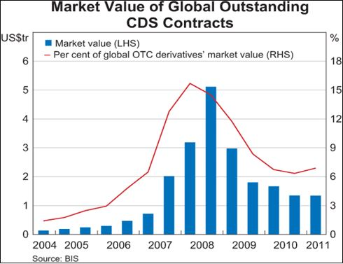

# Project Charter

## Problem Description

### Basics
* **Credit Default Swaps** are an insurance policy against a borrower's ability to repay a loan. An owner of a default swap pays a monthly premium to an insurer of the creditor while the borrower is paying their loan payments on time. If the debtor defaults, the owner of the default swap is compensated by the creditor's insurer.
* The video below captures the basics of CDS

### CDS in the Housing Market
* CDS contracts played a crucial role in the 2007-2008 Housing Market Crash as Hedge Fund Managers purchased millions of dollars worth of Swaps against the Housing Market filled with *subprime mortgages* and reaped hundreds of millions when the bubble burst visualized below.
  

  [Source: Credit Default Swap and Its Role in the 2008 Financial Crisis](https://finecoiitg.wordpress.com/2018/08/16/credit-default-swap-and-its-role-in-the-2008-financial-crisis/)

### CDS Index
* A **Credit Default Swap Index** is a standardized, tradable financial instrument. It is a collection of Credit Default Swaps of varying bonds that has enabled liquidity in the CDS market a standard swap lacks.
* In the 15 years since, modelling Credit Default Swap Indices has never been more crucial to forecast future credit events.

## Project Scope
* SpreadSight is a Time Series Forecasting model for the two major Credit Default Swap Indexes in the North American Market
  * CDX.NA.IG (Investment Grade), composed of 125 CDS contracts for low-risk Corporate loans
  * CDX.NA.HY (High Yield), composed of 100 CDS contracts for high-risk Corporate loans

### Main Goals

* The main deliverable will be a deployed forecasting model using *Serverless Application Model* (SAM) through Amazon Web Services using AWS Lambda and S3. See Planned Cloud Architecture for more information.

* Our client will be delivered a daily forecasting report using Amazon Simple Email Service featuring visualizations of 1 day, 7 day, 30 day trends for IG and HY spreads.

* A Tableau Dashboard visualizing our main insights

### Stretch Goals

* A deployed model that scrapes the features daily to forecast on present data

* A Web Interface that allows users to view the most recent data and the forecasted trends on any given day

## Metrics
* The models will be evaluated using the industry standard backtesting strategies for Financial Forecasting: *Root Mean Squared Error, Mean Absolute Error,* and *Mean Absolute Scaled Error*.

## High Level Plan

* Phase 1: **Data Collection** 02/20/24 - 02/22/24
* Phase 2: **Data Exploration** 02/22/24 - 02/28/24
* Phase 3: **Data Preprocessing** 02/28/24 - 03/11/24
* Phase 4: **Local Model Development** 03/11/24 - 03/19/24 
* Phase 5: **Local Model Evaluation** 03/19/24 - 03/20/24
* Phase 6: **Remote Resources Development** 03/20/24 - 4/13/24
* Phase 7: **Remote Model Deployment** 04/13/24 - 04/21/24

## Low Level Plan

### Phase 1: **Data Collection** 02/12/24 - 02/22/24

  * Colby collected the preliminary dataset from a Bloomberg Terminal at the Fox Business School on 2/12/24 after advice from the University's Economics and Finance librarians.
  * See Data Table section below for more information on the first features.
  * Data Collection is not final, and more features may be added on later.

* Phase 2: **Data Exploration** 02/22/24 - 02/28/24

  * Alan and Colby will build their domain knowledge in this phase. In addition to Exploratory Data Analysis between features and creating graphs, white papers and past work will be reviewed to better grasp why these features were chosen by prior researchers.
  * The Mortgage Feature is already an addition to our model that makes our work original, but are there other features/metrics that could improve a Credit Forecasting model that other researchers did not consider? Is there a reason why? Is the data available? These are the questions to be explored in this phase.

* Phase 3: **Data Preprocessing** 02/28/24 - 03/11/24

  * Phase 2 and 3 are closely linked together as Feature Engineering will begin here pending the conclusions drawn from exploration and the domain-knowledge building phase.
  * Ideas for Features include Percent Change of Features from Previous 30 days, 7 days, 1 day: This artificial short term memory can help mimic a LTSM Neural Network without the added complexity and computational costs. 

* Phase 4: **Local Model Development** 03/11/24 - 03/19/24 

  * Colby and Alan will first begin with developing a base ARIMA model using varying open source Stats Libraries and Models.
  * The pair will diverge here as Alan moves to working on Ensemble Approaches for this problem including Random Forest, Bagging, and different Boosting methods. 
  * Colby will continue working with Time Series models as he begins to explore Seasonal Trends in Seasonal ARIMA and develop a Vector Autoregression Model with a larger feature subset.
 
* Phase 5: **Local Model Evaluation** 03/19/24 - 03/26/24

  * The pair will converge when they have a *best* model based on the selected evaluation metrics for forecasting in 1 day, 7 days, and 30 days.
  * Alan will work on Viz comparing model performance while the two begin to brainstorm the Insights they want visualized on their Tableau Dashboard.
  * Alan will begin work on their Tableau dashboard 

* Phase 6: **Remote Resources Development** 03/27/24 - 4/13/24

  * The AWS Resources required for this project will be built here. Colby will begin work on permissions required for The lambda functions, S3 Buckets, Simple Email Service.
  * (Time permitting and stretch): Alan will explore possible data sources where daily data can be scraped to concat on Test Data for daily Dynamic Forecasting. 
  * Once the pair have decided the insights required for the dashboard, Alan will program one of the Lambda Functions to generate the Parquet File stored in an S3 bucket the dashboard connects to.
  * Colby will test the second Lambda Function with the SES API for sending forecasting graphs via email. 
  * The pair will also test the final Lambda Function can properly pull the .pickle trained model from the S3 Bucket and complete model evaluation.
  * The Workflow will be built here using AWS Triggers and Listeners as the Functions rely on each others' outputs.

* Phase 7: **Remote Model Deployment** 04/13/24 - 04/21/24

  * The Triggers will be activated with CRON Expressions, and the Model will be deployed. We expect Phase 6 to be our most challenging and debugging heavy for a successful deployment. 

## Architecture
* We collected our original dataset from a Bloomberg Terminal at the Temple University Fox School of Business.
* The data includes daily values from August 8, 2012 to February 16, 2024
* We have selected our features based off reviews of prior publications and our desire to combine [Merton's Credit Risk Determinants](https://doi.org/10.2307/2978814) into our Model.
* Potential Models include ARIMA, Seasonal ARIMA, Vector Autoregressive, Ensemble Methods such as Random Forest, and Boosting Methods.
  * *Reccurent Neural Networks will be explored as time permits*

  ### Data Table
| **Feature** | **Description** |
|-------------------|-----------------|
| SPX Index      | The Standard & Poor's 500, or S&P 500, is a stock market index measuring the stock performance of 500 large companies listed on U.S. stock exchanges. It's widely regarded as a key gauge of large-cap U.S. equities, and a factor in Merton's model. |
| VIX Index   | The Volatility Index, or VIX, represents the market's expectations for volatility over the coming 30 days. It is used to gauge the level of fear or stress in the stock market. Although a calculated Volatility for each entity in the IG and HY indices would be superior, it is impossible as many borrowers in each index lack publicly traded options. |
| 30 YR Mort  | The 30-year mortgage rate is the interest rate on a loan to finance the purchase of real estate, typically a home, over 30 years. It's a standard measure of home loan costs in the U.S. It is not explained in Merton's model, but we are using it as a feature because of the direct correlation between Credit Defaults and Mortgage Rates.|
| 5 YR Mat    | US Treasury interest rate on a five-year government or corporate bond, indicating the investment return from a bond maturing in five years. Considered as SPOT interest rate in Merton's model. |
| CDX IG      | The CDX Investment Grade Index is a credit default swap index that tracks the credit risk of a basket of investment-grade corporate bonds, used for hedging or speculating on credit conditions. |
| CDX HY      | The CDX High Yield Index tracks the credit risk of a basket of high-yield bonds, used by investors to manage risk or speculate on the credit conditions of lower-rated corporate bonds. |

### Planned Cloud Architecture

  

* **Not depicted:** A Tableau Dashboard for our insights will be connected to the Parquet File in the S3 Bucket and hosted on Temple's server.

## Personnel
* Who are on this project:
	* Temple University:
		* **Project Lead:** Colby Eigen (Data Science '24)
      * **Lead Analyst:** Alan Uthuppan (Computer Science and Data Science '24)
  * Clients
    * Stephen MacNeil
    * Jovan Andeljkovic

## Communication
* For development, we will be implementing our project in Python code using VSCode as our IDE and GitHub for version control
* Our team members will communicate through Jira and Discord to ensure a streamlined workflow.
* These same methods will be used to communicate project updates to our clients, Stephen MacNeil and Jovan Andjelkovic